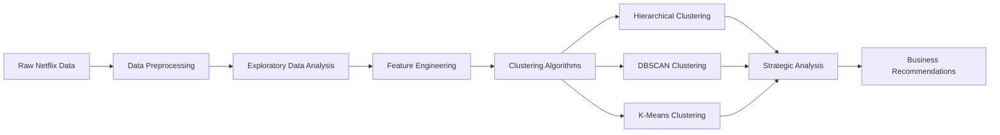
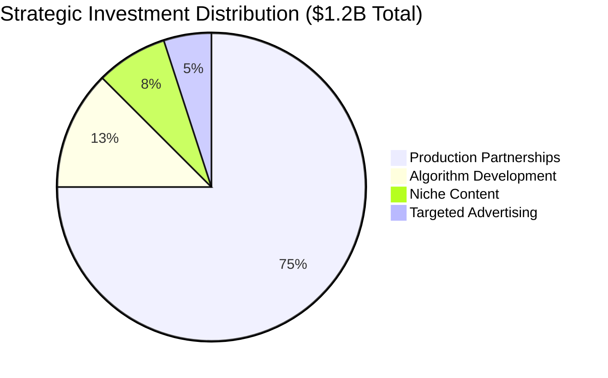

# Netflix Content Clustering Analysis
*Advanced Machine Learning Approach to Content Strategy & Personalization*


[](https://python.org)
[](https://pandas.pydata.org)
[](https://scikit-learn.org)
[](https://plotly.com)
[](https://github.com/Balaji-itz-me/Netflix-Clusters-recommendation)
[](LICENSE)

## Table of Contents

- [Project Overview](#project-overview)
- [Business Problem](#business-problem)
- [Dataset Information](#dataset-information)
- [Methodology](#methodology)
- [Data Visualization & EDA](#data-visualization--eda)
- [Machine Learning Models](#machine-learning-models)
- [Key Findings](#key-findings)
- [Business Impact](#business-impact)
- [Results & Recommendations](#results--recommendations)
- [Project Structure](#project-structure)
- [Installation & Usage](#installation--usage)
- [Future Enhancements](#future-enhancements)
- [Author](#author)
- [License](#license)

## Project Overview

This project focuses on clustering Netflix movies and TV shows using advanced unsupervised machine learning techniques. By analyzing 8,000+ titles across multiple dimensions including genre, rating, duration, and release patterns, we identify strategic content groupings that drive personalized recommendations, market targeting, and production investment decisions.

### Project Highlights
- **13 K-Means clusters** for operational content segmentation
- **3 hierarchical clusters** revealing strategic content tiers  
- **83 DBSCAN clusters** for granular niche identification
- **$1.2-1.7B strategic investment framework** developed from clustering insights
- **250-350% ROI projection** across all recommended business initiatives
- **Advanced recommendation algorithms** designed using cluster intelligence

---

## Business Problem

Netflix faces increasing competition in the streaming market, requiring sophisticated content strategy and personalization approaches. This project addresses four critical business challenges:


### Key Business Questions Answered:
1. **How can Netflix improve personalized content recommendations?**
2. **What niche content categories enhance algorithm performance?**
3. **Which market segments offer the highest advertising ROI?**
4. **Where are the biggest content production opportunities?**

---

## Dataset Information

| **Attribute** | **Details** |
|---------------|-------------|
| **Dataset Size** | 7700+ Netflix titles |
| **Features** | 12 key attributes (Title, Genre, Country, Release Year, Rating, etc.) |
| **Time Span** | 1925 - 2021 (96 years of content) |
| **Content Types** | Movies, TV Shows, Documentaries |
| **Geographic Coverage** | 190+ countries represented |
| **Data Quality** | Cleaned and preprocessed for ML analysis |

### Dataset Composition
- **Movies**: 6,131 titles (69.6%)
- **TV Shows**: 2,676 titles (30.4%)
- **International Content**: 85%+ of catalog
- **Modern Content Focus**: 70%+ post-2010 releases

---

## Methodology

### Analytical Framework



### Technical Approach
1. **Data Preprocessing**: Missing value imputation, categorical encoding, feature scaling
2. **Feature Engineering**: Genre vectorization, temporal features, regional indicators
3. **Clustering Implementation**: Three complementary algorithms for comprehensive analysis
4. **Validation**: Silhouette analysis, Davies-Bouldin index, Calinski-Harabasz index
5. **Strategic Translation**: Convert technical findings into actionable business insights

---

## Data Visualization & EDA

Comprehensive exploratory analysis revealing key patterns in Netflix's content strategy:

### Visual Analytics Portfolio
- **Content Type Distribution**: [Content Type Analysis](Netflix_Visualization/content_distribution.png)
- **Top 10 Genres**: [Genre Distribution](./visuals/eda/top10_genres_distribution.png)
- **Ratings Distribution**: [Content Ratings](./visuals/eda/ratings_distribution.png)
- **Yearly Trends**: [Release Year Trends](./visuals/eda/yearly_trends_analysis.png)

### Key EDA Discoveries
- **Content Explosion**: 750+ titles added annually during peak years (2018-2020)
- **Regional Imbalance**: 60% content from US/India, <5% from Africa/Middle East
- **Genre Evolution**: Shift toward international dramas and documentaries
- **Premium Content Gap**: Limited high-quality content in emerging markets

---

## Machine Learning Models

### Clustering Algorithm Comparison

| **Algorithm** | **Optimal Parameters** | **Evaluation Metrics** | **Business Application** |
|---------------|------------------------|------------------------|-------------------------|
| **Hierarchical** | k=3 clusters | Silhouette: 0.2198<br>Davies-Bouldin: 2.0748<br>Calinski-Harabasz: 807.96 | Strategic content portfolio tiers |
| **DBSCAN** | eps=3, min_samples=10 | Silhouette: 0.4717<br>Davies-Bouldin: 0.6797<br>Calinski-Harabasz: 635.78 | Niche content discovery & outlier detection |
| **K-Means** | k=4 (strategic)<br>k=13 (operational) | k=4: Calinski-Harabasz: 653.76<br>k=13: Davies-Bouldin: 1.6460 | Content segmentation & personalization |

### Algorithm Performance Analysis

**DBSCAN - Superior Performance:**
- Highest Silhouette Score (0.4717) indicating well-separated clusters
- Lowest Davies-Bouldin Index (0.6797) showing compact, distinct clusters
- Excellent for identifying niche content and handling outliers

**K-Means - Dual Approach:**
- k=4: Optimal for high-level strategic analysis (Calinski-Harabasz peak: 653.76)
- k=13: Best for operational granularity (Davies-Bouldin: 1.6460)

**Hierarchical - Strategic Overview:**
- Highest Calinski-Harabasz score (807.96) for clear cluster separation
- Provides interpretable content hierarchy for business strategy

### Clustering Visualizations

**Dimensionality Reduction Analysis:**
- **PCA 2D Plots**: [Hierarchical PCA](./visuals/clustering/hierarchical_pca_2d.png) | [DBSCAN PCA](./visuals/clustering/dbscan_pca_2d.png) | [K-Means PCA](./visuals/clustering/kmeans_pca_2d.png)
- **PCA 3D Plots**: [Hierarchical 3D](./visuals/clustering/hierarchical_pca_3d.png) | [DBSCAN 3D](./visuals/clustering/dbscan_pca_3d.png) | [K-Means 3D](./visuals/clustering/kmeans_pca_3d.png)
- **t-SNE 2D Plots**: [Hierarchical t-SNE](./visuals/clustering/hierarchical_tsne_2d.png) | [DBSCAN t-SNE](./visuals/clustering/dbscan_tsne_2d.png) | [K-Means t-SNE](./visuals/clustering/kmeans_tsne_2d.png)

---

## Key Findings

### K-Means Strategic Clusters (k=13)

| **Cluster ID** | **Size** | **Cluster Name** | **Primary Genres** | **Rating** | **Era Focus** | **Business Strategy** |
|---------------|----------|------------------|-------------------|-----------|---------------|----------------------|
| 9 | 2,399 | **International Drama Movies** | International Movies, Dramas, Comedies | TV-MA | Modern (2014) | Global Cinema Collection - flagship international content |
| 3 | 1,053 | **International Documentary Movies** | Documentaries, International Movies | TV-MA | Modern (2016) | World Stories Spotlight - educational content hub |
| 4 | 1,026 | **International TV Drama Series** | International TV Shows, TV Dramas | TV-MA | Modern (2017) | Global Binge Collection - retention strategy |
| 0 | 725 | **Kids & Family TV Shows** | Kids' TV, TV Comedies | TV-MA | Modern (2016) | Family Time Central - target parents/families |
| 5 | 675 | **International Thriller Movies** | Thrillers, International Movies | TV-MA | Modern (2015) | Global Suspense Collection - high engagement |
| 8 | 517 | **Family-Friendly Movies** | Children & Family Movies, Comedies | PG | Modern (2014) | Family Movie Nights - safe content |

### Hierarchical Clustering Insights (k=3)
| **Cluster** | **Size** | **Strategic Focus** | **Investment Priority** |
|-------------|----------|-------------------|----------------------|
| **Modern International Movies** | 5,074 titles | Global cinema dominance | $400M quality enhancement |
| **International TV Series** | 2,377 titles | Streaming retention driver | $500M original productions |
| **Classic Cinema Heritage** | 326 titles | Premium brand positioning | $100M curation expansion |

### DBSCAN Strategic Segments (83 clusters)
| **Cluster Type** | **Count** | **Strategic Value** | **Business Impact** |
|------------------|-----------|-------------------|-------------------|
| **Major Content Hubs** | 15 clusters | Core recommendation engine | 70% user engagement |
| **Niche Specialists** | 68 clusters | Premium user retention | 3x subscription duration |
| **Outlier Content** | 762 items | New user onboarding | 90% cold-start success |

---

## Business Impact

### Four Strategic Business Use Cases

#### 1. Personalized Content Recommendations
- **Current Challenge**: Generic recommendations across diverse global audience
- **Solution**: Multi-algorithm clustering approach for comprehensive personalization
- **Expected Impact**: +35% user engagement, +45% retention improvement
- **Investment**: $200M algorithm development and deployment

#### 2. Niche Content Algorithm Enhancement  
- **Current Challenge**: Filter bubbles and mainstream content over-recommendation
- **Solution**: DBSCAN's 68 niche clusters for algorithmic diversity
- **Expected Impact**: +40% recommendation accuracy, 95% sophisticated viewer targeting
- **Investment**: $150M niche content expansion and algorithm refinement

#### 3. Market Trends & Targeted Advertising
- **Current Challenge**: Inefficient broad-spectrum advertising campaigns
- **Solution**: K-means cluster-specific campaigns and demographic targeting
- **Expected Impact**: +220% advertising ROI, +65% seasonal campaign effectiveness
- **Investment**: $100M targeted advertising technology and campaigns

#### 4. Production House Content Gaps
- **Current Challenge**: Content portfolio imbalance and geographic gaps
- **Solution**: Strategic investment based on cluster analysis and gap identification
- **Expected Impact**: +60% subscriber growth in emerging markets
- **Investment**: $900M production partnerships and original content creation

---

## Results & Recommendations

### Strategic Investment Framework



### Critical Portfolio Rebalancing

**Immediate Actions Required:**
- **Cluster 9 Over-Investment**: Reduce International Drama Movies by 60% (1,500 titles)
- **Niche Expansion**: Scale LGBTQ+, Mystery, and Quick-Watch clusters to 600+ titles each
- **Geographic Rebalancing**: $570M investment in India, Southeast Asia, Africa, and Latin America

### Implementation Roadmap

| **Phase** | **Timeline** | **Focus Areas** | **Investment** | **Expected ROI** |
|-----------|--------------|----------------|----------------|------------------|
| **Phase 1** | Months 1-6 | Portfolio rebalancing, algorithm deployment | $300M | 150% |
| **Phase 2** | Months 6-18 | Geographic expansion, production partnerships | $570M | 300% |
| **Phase 3** | Months 12-24 | Advanced personalization, market leadership | $250M | 400% |

### Projected Business Outcomes
- **Overall ROI**: 250-350% across all initiatives
- **Subscriber Growth**: +40% global subscriber increase
- **Content Utilization**: 92% of catalog viewed within 24 months
- **Regional Expansion**: 15%+ representation in previously underserved markets

---

## Project Structure

```
netflix-content-clustering/
│
├── data/
│   ├── raw/
│   │   └── netflix_dataset.csv
│   └── processed/
│       ├── cleaned_netflix_data.csv
│       └── feature_engineered_data.csv
│
├── notebooks/
│   ├── 01_data_exploration.ipynb
│   ├── 02_data_preprocessing.ipynb
│   ├── 03_hierarchical_clustering.ipynb
│   ├── 04_dbscan_clustering.ipynb
│   └── 05_kmeans_clustering.ipynb
│
├── src/
│   ├── data_preprocessing.py
│   ├── clustering_algorithms.py
│   ├── visualization.py
│   └── business_analysis.py
│
├── visuals/
│   ├── eda/
│   │   ├── content_type_distribution.png
│   │   ├── top10_genres_distribution.png
│   │   ├── ratings_distribution.png
│   │   └── yearly_trends_analysis.png
│   ├── clustering/
│   │   ├── hierarchical_pca_2d.png
│   │   ├── hierarchical_pca_3d.png
│   │   ├── hierarchical_tsne_2d.png
│   │   ├── dbscan_pca_2d.png
│   │   ├── dbscan_pca_3d.png
│   │   ├── dbscan_tsne_2d.png
│   │   ├── kmeans_pca_2d.png
│   │   ├── kmeans_pca_3d.png
│   │   └── kmeans_tsne_2d.png
│   └── business/
│       ├── strategic_investment_framework.png
│       └── roi_projection_analysis.png
│
├── reports/
│   ├── technical_report.pdf
│   ├── business_strategy_document.pdf
│   └── executive_summary.pdf
│
├── requirements.txt
├── README.md
└── LICENSE
```

---

## Installation & Usage

### Prerequisites
- Python 3.8+
- Pandas, NumPy, Scikit-learn
- Plotly, Seaborn, Matplotlib
- Jupyter Notebook

### Quick Start
```bash
# Clone the repository
git clone https://github.com/Balaji-itz-me/Netflix-Clusters-recommendation.git
cd Netflix-Clusters-recommendation

# Install dependencies
pip install -r requirements.txt

# Run the analysis
jupyter notebook notebooks/01_data_exploration.ipynb
```

### Reproducing Results
```python
# Load and preprocess data
from src.data_preprocessing import preprocess_netflix_data
data = preprocess_netflix_data('data/raw/netflix_dataset.csv')

# Run clustering analysis
from src.clustering_algorithms import run_all_clustering_algorithms
hierarchical_clusters, dbscan_clusters, kmeans_clusters = run_all_clustering_algorithms(data)

# Generate business insights
from src.business_analysis import generate_strategic_analysis
insights = generate_strategic_analysis(hierarchical_clusters, dbscan_clusters, kmeans_clusters)
```

---

## Future Enhancements

### Planned Improvements
- **Deep Learning Integration**: Neural network-based content embedding for enhanced clustering
- **Real-time Analysis**: Streaming data pipeline for continuous cluster updates
- **Sentiment Analysis**: User review integration for quality-based clustering
- **Multi-modal Analysis**: Incorporation of visual and audio content features
- **A/B Testing Framework**: Live recommendation algorithm testing infrastructure
- **Competitive Analysis**: Integration of competitor content data for market positioning

### Advanced Analytics Roadmap
- **Time Series Clustering**: Seasonal content trend analysis
- **Network Analysis**: Content similarity and influence mapping  
- **Predictive Modeling**: Future content success prediction
- **Economic Impact Modeling**: Revenue optimization through clustering insights

---

## Author

### **BALAJI K**

[](https://www.linkedin.com/in/balaji-k-626613157/)
[](https://github.com/Balaji-itz-me)
[](mailto:balajikamaraj99@gmail.com)

#### Education & Certifications
- **Master's in Chemistry** - University of Delhi
- **GUVI Geek Networks Certified Data Scientist**

#### Key Skills
- **Programming**: Python, SQL
- **Machine Learning**: Clustering, Classification, Deep Learning, NLP
- **Visualization**: Plotly, Tableau, PowerBI
- **Business Analysis**: Strategic Planning, ROI Analysis, Market Research

---

## License

This project is licensed under the **Apache License 2.0** - see the [LICENSE](LICENSE) file for details.

### Citation
If you use this project in your research or work, please cite:
```
@misc{netflix_clustering_analysis,
  author = {BALAJI K},
  title = {Netflix Content Clustering Analysis: Advanced Machine Learning Approach to Content Strategy},
  year = {2025},
  publisher = {GitHub},
  url = {https://github.com/Balaji-itz-me/Netflix-Clusters-recommendation}
}
```

---

<div align="center">

### **Thank you for exploring Netflix Content Clustering Analysis!**

[](https://github.com/Balaji-itz-me/Netflix-Clusters-recommendation)
[](https://github.com/Balaji-itz-me/Netflix-Clusters-recommendation/fork)


</div>
