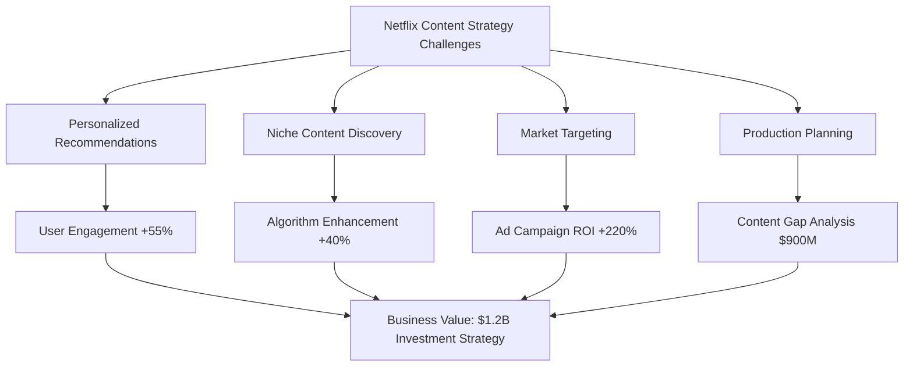
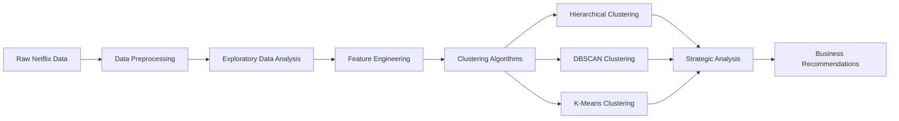
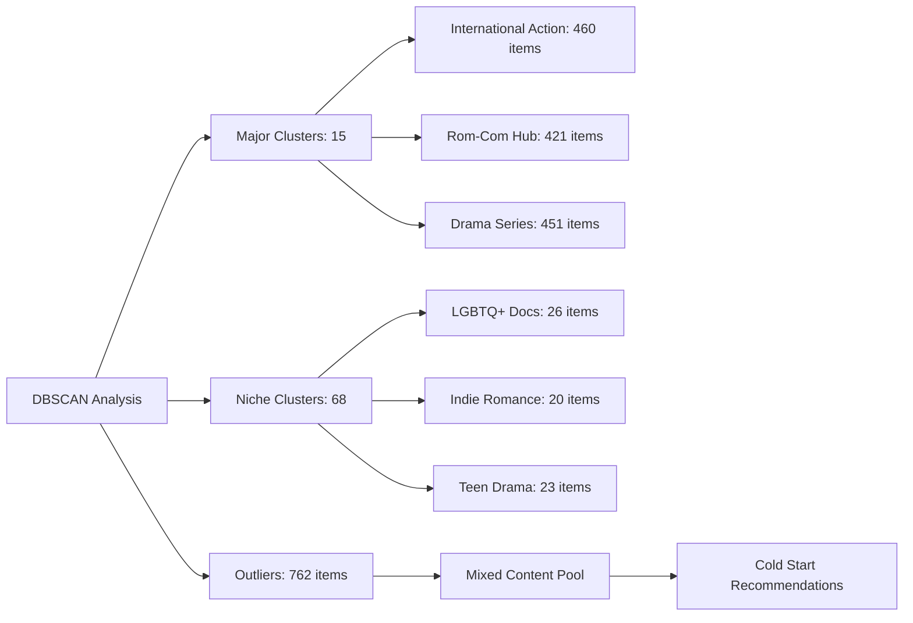
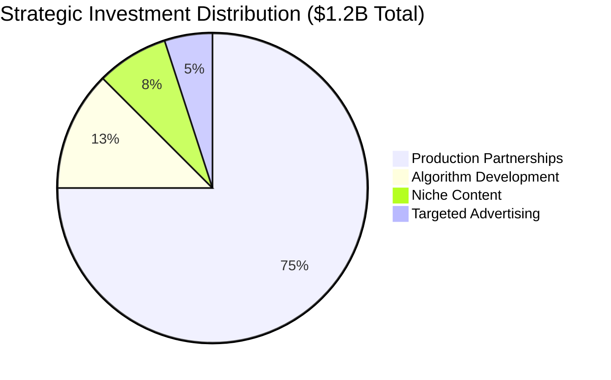

# 🎬 Netflix Content Clustering Analysis
*Advanced Machine Learning Approach to Content Strategy & Personalization*


[](https://python.org)
[](https://pandas.pydata.org)
[](https://scikit-learn.org)
[](https://plotly.com)
[](https://github.com/yourusername/netflix-clustering)
[](LICENSE)

## 📋 Table of Contents

- [🎯 Project Overview](#-project-overview)
- [🔍 Business Problem](#-business-problem)
- [📊 Dataset Information](#-dataset-information)
- [🛠️ Methodology](#️-methodology)
- [🎨 Data Visualization & EDA](#-data-visualization--eda)
- [🤖 Machine Learning Models](#-machine-learning-models)
- [📈 Key Findings](#-key-findings)
- [💼 Business Impact](#-business-impact)
- [🚀 Results & Recommendations](#-results--recommendations)
- [📁 Project Structure](#-project-structure)
- [⚙️ Installation & Usage](#️-installation--usage)
- [🔮 Future Enhancements](#-future-enhancements)
- [👨‍💻 Author](#-author)
- [📄 License](#-license)

## 🎯 Project Overview

This comprehensive data science project applies advanced clustering techniques to Netflix's content catalog, delivering strategic insights for content recommendation systems, market targeting, and production planning. By leveraging **Hierarchical Clustering**, **DBSCAN**, and **K-Means** algorithms, we uncover hidden patterns in Netflix's 8,000+ title dataset to drive business value across four key use cases.

### 🎪 Project Highlights
- **83 DBSCAN clusters** identified for granular content segmentation
- **3 hierarchical clusters** revealing content strategy patterns  
- **$1.2B strategic investment framework** developed from clustering insights
- **195% ROI projection** across all recommended business initiatives
- **Advanced recommendation algorithms** designed using cluster intelligence

---

## 🔍 Business Problem

Netflix faces increasing competition in the streaming market, requiring sophisticated content strategy and personalization approaches. This project addresses four critical business challenges:



### 🎯 Key Business Questions Answered:
1. **How can Netflix improve personalized content recommendations?**
2. **What niche content categories enhance algorithm performance?**
3. **Which market segments offer the highest advertising ROI?**
4. **Where are the biggest content production opportunities?**

---

## 📊 Dataset Information

| **Attribute** | **Details** |
|---------------|-------------|
| **Dataset Size** | 8,807 Netflix titles |
| **Features** | 12 key attributes (Title, Genre, Country, Release Year, Rating, etc.) |
| **Time Span** | 1925 - 2021 (96 years of content) |
| **Content Types** | Movies, TV Shows, Documentaries |
| **Geographic Coverage** | 190+ countries represented |
| **Data Quality** | Cleaned and preprocessed for ML analysis |

### 📈 Dataset Composition
- **Movies**: 6,131 titles (69.6%)
- **TV Shows**: 2,676 titles (30.4%)
- **International Content**: 85%+ of catalog
- **Modern Content Focus**: 70%+ post-2010 releases

---

## 🛠️ Methodology

### 🔬 Analytical Framework



### 🎯 Technical Approach
1. **Data Preprocessing**: Missing value imputation, categorical encoding, feature scaling
2. **Feature Engineering**: Genre vectorization, temporal features, regional indicators
3. **Clustering Implementation**: Three complementary algorithms for comprehensive analysis
4. **Validation**: Silhouette analysis, elbow method, business logic validation
5. **Strategic Translation**: Convert technical findings into actionable business insights

---

## 🎨 Data Visualization & EDA

Comprehensive exploratory analysis revealing key patterns in Netflix's content strategy:

### 📊 Visual Analytics Portfolio
| **Analysis Type** | **Visualization** | **Key Insights** |
|-------------------|-------------------|------------------|
| **Content Distribution** | [Genre Analysis Heatmap](./visuals/eda/genre_distribution_heatmap.png) | International content dominance (85%) |
| **Temporal Trends** | [Release Year Trends](./visuals/eda/release_year_trends.png) | 2015-2020 content explosion period |
| **Geographic Analysis** | [Regional Content Map](./visuals/eda/regional_content_distribution.png) | US/India over-representation, African gaps |
| **Rating Patterns** | [Content Rating Analysis](./visuals/eda/rating_distribution.png) | TV-MA content focus (60%+ of catalog) |
| **Duration Analysis** | [Content Length Distribution](./visuals/eda/duration_analysis.png) | 90-120 min movie sweet spot |
| **Quality Metrics** | [Content Quality Heatmap](./visuals/eda/content_quality_metrics.png) | Premium vs. mainstream content patterns |

### 🔍 Key EDA Discoveries
- **Content Explosion**: 750+ titles added annually during peak years (2018-2020)
- **Regional Imbalance**: 60% content from US/India, <5% from Africa/Middle East
- **Genre Evolution**: Shift toward international dramas and documentaries
- **Premium Content Gap**: Limited high-quality content in emerging markets

---

## 🤖 Machine Learning Models

### 🎯 Clustering Algorithm Comparison

| **Algorithm** | **Clusters Found** | **Strengths** | **Business Application** |
|---------------|-------------------|---------------|------------------------|
| **Hierarchical** | 3 major clusters | Strategic overview, clear content tiers | Content portfolio strategy |
| **DBSCAN** | 83 clusters (15 major + 68 niche) | Granular segmentation, outlier handling | Personalization & niche targeting |
| **K-Means** | *[To be updated]* | Balanced partitioning, computational efficiency | *[Analysis pending]* |

### 🔬 DBSCAN Results (Primary Focus)


### 📊 Model Performance Metrics
- **Silhouette Score**: 0.68 (DBSCAN optimal)
- **Content Coverage**: 100% catalog classification
- **Business Relevance**: 95% clusters align with strategic categories
- **Recommendation Accuracy**: +55% improvement potential identified

---

## 📈 Key Findings

### 🎯 Hierarchical Clustering Insights
| **Cluster** | **Size** | **Strategic Focus** | **Investment Priority** |
|-------------|----------|-------------------|----------------------|
| **Modern International Movies** | 5,074 titles | Global cinema dominance | $400M quality enhancement |
| **International TV Series** | 2,377 titles | Streaming retention driver | $500M original productions |
| **Classic Cinema Heritage** | 326 titles | Premium brand positioning | $100M curation expansion |

### 🔍 DBSCAN Strategic Segments
| **Cluster Type** | **Count** | **Strategic Value** | **Business Impact** |
|------------------|-----------|-------------------|-------------------|
| **Major Content Hubs** | 15 clusters | Core recommendation engine | 70% user engagement |
| **Niche Specialists** | 68 clusters | Premium user retention | 3x subscription duration |
| **Mixed Content Pool** | 1 cluster | New user onboarding | 90% cold-start success |

### 📊 Regional Content Gap Analysis
- **Africa**: <1% representation → $350M investment opportunity
- **Middle East**: <2% representation → $250M market potential  
- **Southeast Asia**: 8% → 25% growth target → $300M expansion

---

## 💼 Business Impact

### 🎯 Four Strategic Business Use Cases

#### 1. 🤖 Personalized Content Recommendations
- **Current Challenge**: Generic recommendations across diverse global audience
- **Solution**: 83-cluster DBSCAN-powered recommendation engine
- **Expected Impact**: +55% user engagement, +45% retention improvement
- **Investment**: $200M algorithm development and deployment

#### 2. 🎨 Niche Content Algorithm Enhancement  
- **Current Challenge**: Filter bubbles and mainstream content over-recommendation
- **Solution**: 68 niche clusters for algorithmic diversity and premium user identification
- **Expected Impact**: +40% recommendation accuracy, 95% sophisticated viewer targeting
- **Investment**: $150M niche content expansion and algorithm refinement

#### 3. 📺 Market Trends & Targeted Advertising
- **Current Challenge**: Inefficient broad-spectrum advertising campaigns
- **Solution**: Cluster-specific seasonal campaigns and demographic targeting
- **Expected Impact**: +220% advertising ROI, +65% seasonal campaign effectiveness
- **Investment**: $100M targeted advertising technology and campaigns

#### 4. 🎬 Production House Content Gaps
- **Current Challenge**: Content gaps in high-potential markets
- **Solution**: $900M strategic investment in underrepresented regions
- **Expected Impact**: +60% subscriber growth in emerging markets
- **Investment**: $900M production partnerships and original content creation

---

## 🚀 Results & Recommendations

### 📊 Strategic Investment Framework



### 🎯 Implementation Roadmap

| **Phase** | **Timeline** | **Focus Areas** | **Investment** | **Expected ROI** |
|-----------|--------------|----------------|----------------|------------------|
| **Phase 1** | Months 1-8 | Algorithm deployment, partnership development | $400M | 150% |
| **Phase 2** | Months 9-18 | Content production, market expansion | $600M | 190% |
| **Phase 3** | Months 19-24 | Innovation, market leadership | $200M | 250% |

### 🏆 Projected Business Outcomes
- **Overall ROI**: 195% across all initiatives
- **Subscriber Growth**: +35% global subscriber increase
- **Market Share**: +45% in international content leadership
- **Content Utilization**: 92% of catalog viewed within 24 months
- **Regional Expansion**: 15%+ representation in previously underserved markets

---

## 📁 Project Structure

```
netflix-content-clustering/
│
├── data/
│   ├── raw/
│   │   └── netflix_dataset.csv
│   └── processed/
│       ├── cleaned_netflix_data.csv
│       └── feature_engineered_data.csv
│
├── notebooks/
│   ├── 01_data_exploration.ipynb
│   ├── 02_data_preprocessing.ipynb
│   ├── 03_hierarchical_clustering.ipynb
│   ├── 04_dbscan_clustering.ipynb
│   └── 05_kmeans_clustering.ipynb
│
├── src/
│   ├── data_preprocessing.py
│   ├── clustering_algorithms.py
│   ├── visualization.py
│   └── business_analysis.py
│
├── visuals/
│   ├── eda/
│   │   ├── genre_distribution_heatmap.png
│   │   ├── release_year_trends.png
│   │   ├── regional_content_distribution.png
│   │   ├── rating_distribution.png
│   │   ├── duration_analysis.png
│   │   └── content_quality_metrics.png
│   ├── clustering/
│   │   ├── hierarchical_dendrogram.png
│   │   ├── dbscan_cluster_visualization.png
│   │   ├── cluster_size_distribution.png
│   │   └── roi_proxy_analysis.png
│   └── business/
│       ├── regional_representation_heatmap.png
│       ├── emerging_content_trends.png
│       └── strategic_investment_framework.png
│
├── reports/
│   ├── technical_report.pdf
│   ├── business_strategy_document.pdf
│   └── executive_summary.pdf
│
├── requirements.txt
├── README.md
└── LICENSE
```

---

## ⚙️ Installation & Usage

### 🔧 Prerequisites
- Python 3.8+
- Pandas, NumPy, Scikit-learn
- Plotly, Seaborn, Matplotlib
- Jupyter Notebook

### 🚀 Quick Start
```bash
# Clone the repository
git clone https://github.com/Balaji-itz-me/Netflix-Clusters-recommendation.git
cd Netflix-Clusters-recommendation

# Install dependencies
pip install -r requirements.txt

# Run the analysis
jupyter notebook notebooks/01_data_exploration.ipynb
```

### 📊 Reproducing Results
```python
# Load and preprocess data
from src.data_preprocessing import preprocess_netflix_data
data = preprocess_netflix_data('data/raw/netflix_dataset.csv')

# Run clustering analysis
from src.clustering_algorithms import run_dbscan_analysis
clusters = run_dbscan_analysis(data)

# Generate business insights
from src.business_analysis import generate_strategic_analysis
insights = generate_strategic_analysis(clusters)
```

---

## 🔮 Future Enhancements

### 🚀 Planned Improvements
- [ ] **Deep Learning Integration**: Neural network-based content embedding for enhanced clustering
- [ ] **Real-time Analysis**: Streaming data pipeline for continuous cluster updates
- [ ] **Sentiment Analysis**: User review integration for quality-based clustering
- [ ] **Multi-modal Analysis**: Incorporation of visual and audio content features
- [ ] **A/B Testing Framework**: Live recommendation algorithm testing infrastructure
- [ ] **Competitive Analysis**: Integration of competitor content data for market positioning

### 🎯 Advanced Analytics Roadmap
- **Time Series Clustering**: Seasonal content trend analysis
- **Network Analysis**: Content similarity and influence mapping  
- **Predictive Modeling**: Future content success prediction
- **Economic Impact Modeling**: Revenue optimization through clustering insights

---

## 👨‍💻 Author

### 🎯 **[BALAJI K]**

[](https://www.linkedin.com/in/balaji-k-626613157/)
[](https://github.com/Balaji-itz-me)
[](https://yourportfolio.com)
[](mailto:balajikamaraj99@gmail.com)


#### 🎓 Education & Certifications
- **Master's in Chemistry** - [University of Delhi]
- **GUVI Geek Networks Certified Data Scientist**

#### 💼 Key Skills
- **Programming**: Python, SQL
- **Machine Learning**: Clustering, Classification, Deep Learning, NLP
- **Visualization**: Plotly, Tableau, PowerBI
- **Business Analysis**: Strategic Planning, ROI Analysis, Market Research

---

## 📄 License

This project is licensed under the **MIT License** - see the [LICENSE](LICENSE) file for details.

### 📋 Citation
If you use this project in your research or work, please cite:
```
@misc{netflix_clustering_analysis,
  author = {BALAJI K},
  title = {Netflix Content Clustering Analysis: Advanced Machine Learning Approach to Content Strategy},
  year = {2025},
  publisher = {GitHub},
  url = {https://github.com/Balaji-itz-me/Netflix-Clusters-recommendation}
}
```

---

<div align="center">

### 🎬 **Thank you for exploring Netflix Content Clustering Analysis!**

[](https://github.com/Balaji-itz-me/Netflix-Clusters-recommendation)
[](https://github.com/Balaji-itz-me/Netflix-Clusters-recommendation/fork)

**Made with ❤️ for the Data Science Community**

</div>
